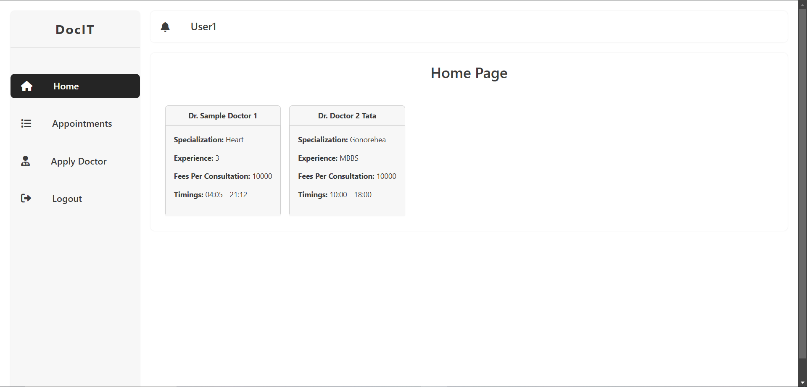
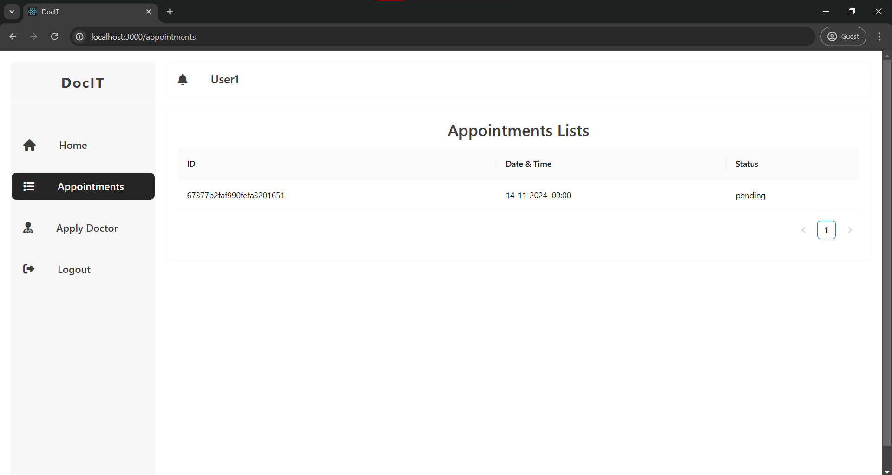
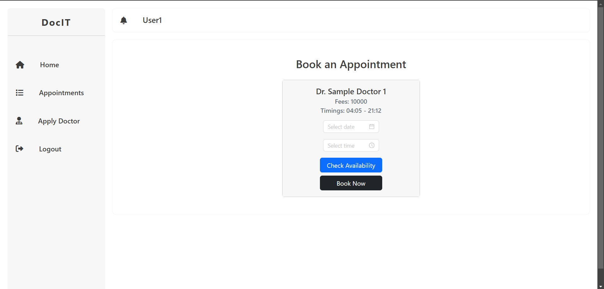
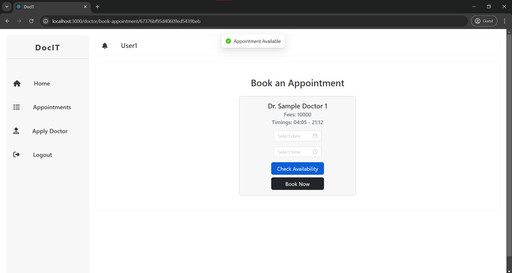
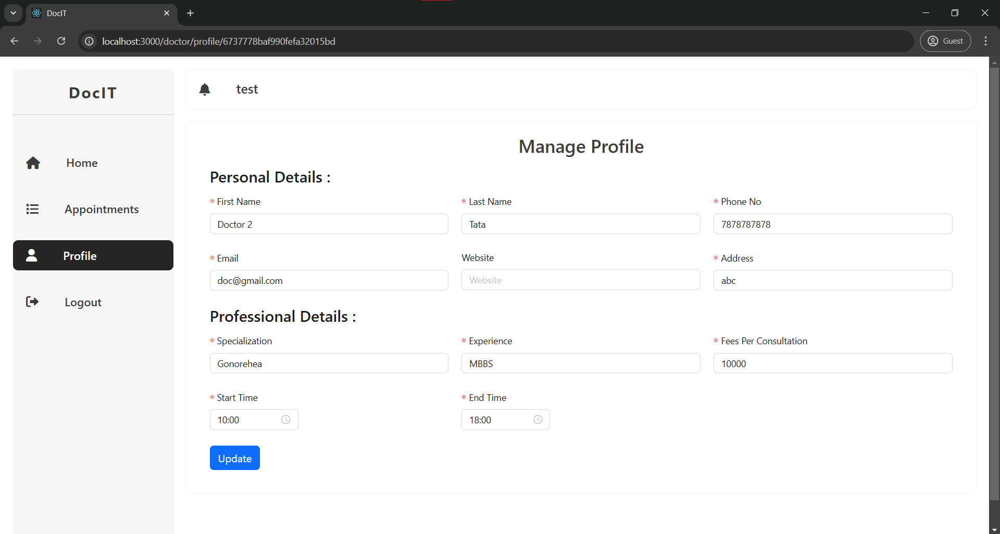
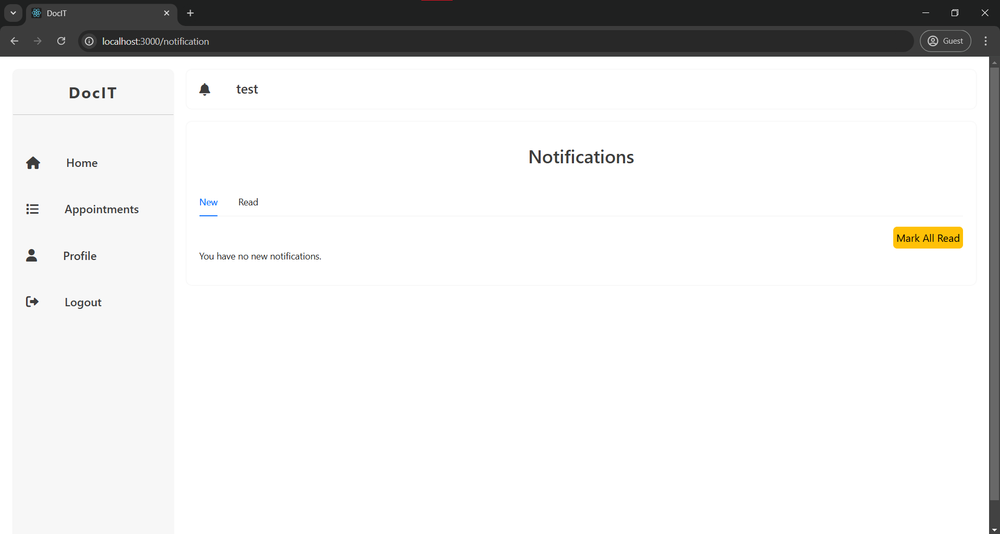
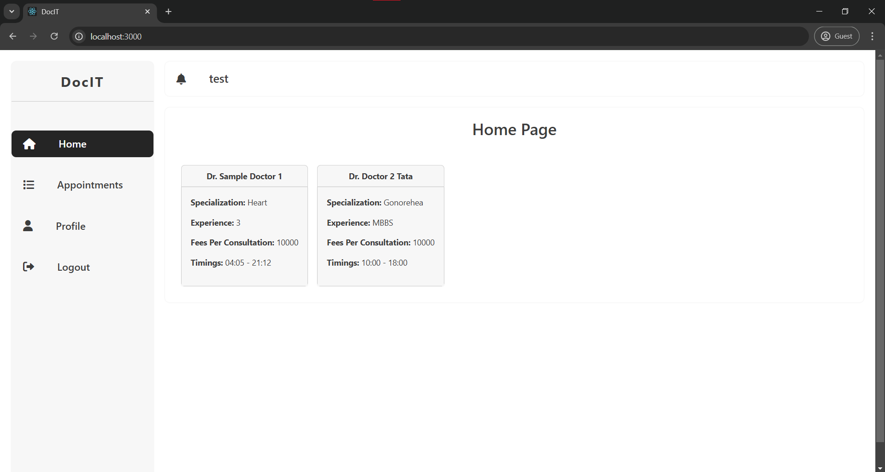
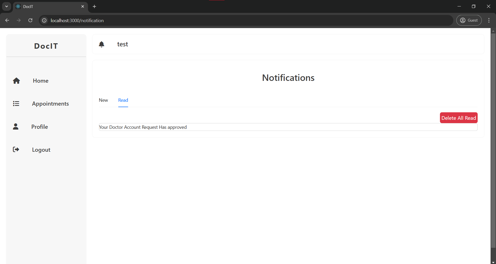
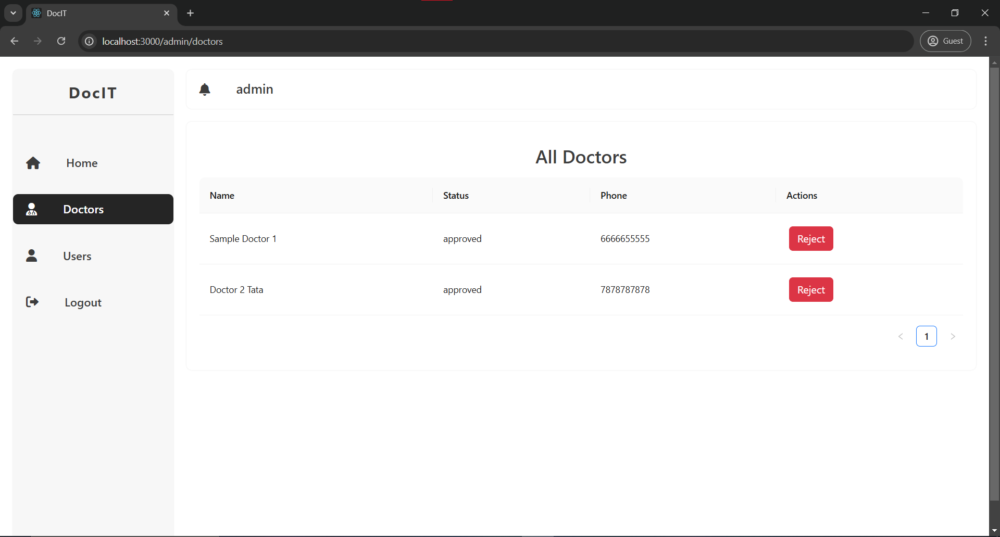
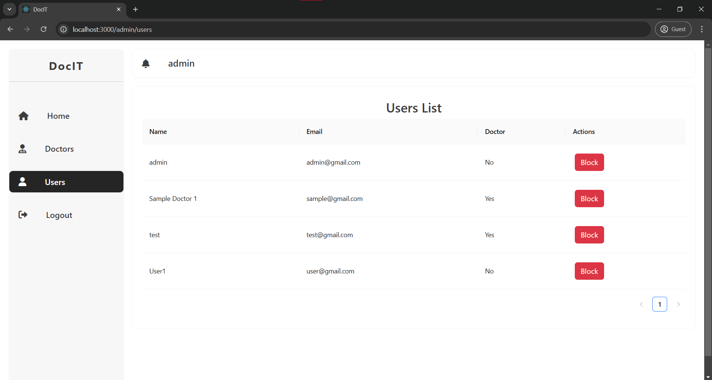

# DocIT

This is a MERN (MongoDB, Express, React, Node.js) stack web application for booking doctor appointments. Patients can browse through a list of doctors and their availability and book an appointment with their preferred doctor. Doctors can view their schedule, manage their availability, and approve/cancel appointments.

## Project View

<h4>1. For User Profile<h4/>

- **Homepage**

  

- **Appointment Lists**

  

  

  
- **Booking Appointment**

  

  

  

  
- **Apply As Doctor**

  

- **Read Notifications**

  

<h4>2. For Doctor Profile<h4/>
  
- **Homepage**

  

  
-**Manage Profile** 

  

- **Appointment Notifications**

  

  

  
<h4>3. For Admin Profile<h4/>

- **Doctors List**

  

- **Users List**

  

## Installation

To set up locally, follow these steps:

- Clone the repository:

      git clone https://github.com/ShaunSDavid/DocIT_MERN_App.git

- Install the required dependencies for backend:

      npm install express joi jsonwebtoken moment mongoose morgan nodemon zxcvbn dotenv colors bcryptjs

- Navigate to the client directory:

       cd client

- Install the dependencies for the client:

       npm i react-router-dom react-redux axios antd @reduxjs/toolkit react-bootstrap moment

- Create a .env file in the root directory with the following environment variables:

       DB_URL = mongodb+srv://<useer>:<userdb_password>@cluster0.0wbc7.mongodb.net

       JWT_SECRET = A_Secret_Value

       PORT = 4000

- Start the server:

       npm start

- In a new terminal window, navigate to the client directory:

       cd client

- Start the client:

       npm start

- Access the application. Open your web browser and visit http://localhost:3000 to access the application.

## Stack

- MongoDB - NoSQL database for storing data
- Express - Backend framework for building RESTful APIs
- React - Frontend framework for building user interfaces
- Node.js - JavaScript runtime environment for building scalable server-side applications
